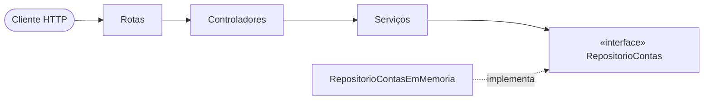

# API de Gestão de Contas Bancárias

API REST para abertura, consulta, movimentação e encerramento de contas bancárias, com uma interface mínima em React que consome a API. O foco do projeto é arquitetura em camadas, regras de negócio testadas e tratamento de erros consistente.

**Backend:** Node.js · TypeScript · Express 5 · Zod · Vitest + Supertest
**Frontend:** React 19 · Vite · TypeScript
**Persistência:** repositório em memória, substituível por um banco real sem alterar regras de negócio

## Arquitetura



| Camada | Responsabilidade |
|---|---|
| Rotas | Mapeia verbo + URL para o controlador |
| Controladores | Traduz HTTP ↔ domínio: valida a entrada e define o status da resposta |
| Serviços | Regras de negócio, sem conhecer o Express |
| Repositórios | Acesso a dados por trás de um contrato (interface) |

Erros de domínio sobem como exceções tipadas e um único middleware os converte em resposta HTTP.

## Decisões técnicas

- **Dinheiro em centavos (inteiros).** Em ponto flutuante, `0.1 + 0.2 !== 0.3`; nenhum valor monetário trafega como `float`.
- **Inversão de dependência.** O serviço depende de `RepositorioContas`, não da implementação em memória. Migrar para PostgreSQL é escrever uma nova classe e trocar uma linha em `aplicacao.ts`.
- **Validação na fronteira.** O Zod valida e normaliza a entrada (inclusive os dígitos verificadores do CPF) antes de ela chegar ao serviço.
- **Encerramento lógico.** `DELETE` não apaga o registro: a conta passa a `ENCERRADA` e deixa de aceitar operações.
- **Express 5.** Erros lançados em handlers `async` chegam ao middleware de erros sem `try/catch` nos controladores.
- **Aplicação separada do servidor.** `criarAplicacao()` monta as dependências, o que permite testar a API sem abrir porta.

## Regras de negócio

- Um CPF pode ter no máximo uma conta ativa.
- O saque não pode exceder o saldo.
- A conta só pode ser encerrada com saldo zerado.
- Conta encerrada não aceita movimentações nem alterações de cadastro.
- O CPF do titular não pode ser alterado.

## Endpoints

Base: `/api/v1/contas`

| Método | Rota | Descrição | Sucesso | Erros |
|---|---|---|---|---|
| `POST` | `/` | Abre uma conta | 201 | 400, 409 |
| `GET` | `/` | Lista as contas | 200 | — |
| `GET` | `/:id` | Detalha uma conta | 200 | 404 |
| `GET` | `/:id/titular` | Consulta o titular | 200 | 404 |
| `PATCH` | `/:id/titular` | Atualiza nome e/ou e-mail | 200 | 400, 404, 422 |
| `GET` | `/:id/saldo` | Consulta o saldo | 200 | 404 |
| `POST` | `/:id/depositos` | Deposita | 200 | 400, 404, 422 |
| `POST` | `/:id/saques` | Saca | 200 | 400, 404, 422 |
| `DELETE` | `/:id` | Encerra a conta | 204 | 404, 422 |

Exemplo de abertura de conta:

```bash
curl -X POST http://localhost:3333/api/v1/contas \
  -H "Content-Type: application/json" \
  -d '{"nome":"Maria Silva","cpf":"529.982.247-25","email":"maria@email.com"}'
```

```json
{
  "id": "5f7ea46a-4101-4176-9e3b-501b933fee5c",
  "titular": { "nome": "Maria Silva", "cpf": "52998224725", "email": "maria@email.com" },
  "saldoEmCentavos": 0,
  "status": "ATIVA",
  "criadaEm": "2026-10-01T18:54:32.810Z"
}
```

### Erros

Toda falha segue o mesmo formato:

```json
{
  "erro": {
    "codigo": "DADOS_INVALIDOS",
    "mensagem": "Os dados enviados são inválidos.",
    "detalhes": [{ "campo": "cpf", "mensagem": "CPF inválido" }]
  }
}
```

| Status | Quando |
|---|---|
| 400 | Dados inválidos ou JSON malformado |
| 404 | Conta ou rota inexistente |
| 409 | CPF já possui conta ativa |
| 422 | Regra de negócio violada: saldo insuficiente, saldo não zerado ou conta encerrada |

## Como executar

Requisito: Node.js 22.12 ou superior.

```bash
# API em http://localhost:3333
cd backend
npm install
npm run dev

# Interface em http://localhost:5173 (em outro terminal)
cd frontend
npm install
npm run dev
```

O Vite repassa as chamadas `/api` para o backend, então não é preciso configurar CORS.

### Testes

```bash
cd backend
npm test            # testes unitários e de integração
npm run typecheck   # checagem de tipos
```

## Deploy

| Parte | Plataforma | Configuração |
|---|---|---|
| API | Render | [`render.yaml`](render.yaml) (Blueprint, diretório `backend`) |
| Interface | Vercel | [`vercel.json`](vercel.json) (build do diretório `frontend`) |

Em produção, a Vercel reescreve `/api/*` para a API no Render, mantendo o mesmo esquema do proxy do Vite: o frontend continua usando caminhos relativos e não há CORS. Como o repositório é em memória, os dados são perdidos quando a instância gratuita do Render hiberna.

## Estrutura

```
backend/src/
├── modelos/        Entidade ContaBancaria e Titular
├── repositorios/   Contrato + implementação em memória
├── servicos/       Regras de negócio
├── controladores/  HTTP ↔ domínio
├── rotas/          Verbo + URL → controlador
├── validacao/      Esquemas Zod
├── erros/          Erros de domínio
├── middlewares/    Tratamento centralizado de erros
├── aplicacao.ts    Montagem das dependências
└── servidor.ts     Inicialização

frontend/src/
├── servicos/       Cliente HTTP tipado
├── hooks/          Estado e chamadas à API
├── componentes/    Interface
└── utilitarios/    Formatação de moeda, CPF e data
```

## Próximos passos

- Persistência em PostgreSQL implementando `RepositorioContas`
- Extrato com o histórico de movimentações
- Autenticação e controle de concorrência nas movimentações
